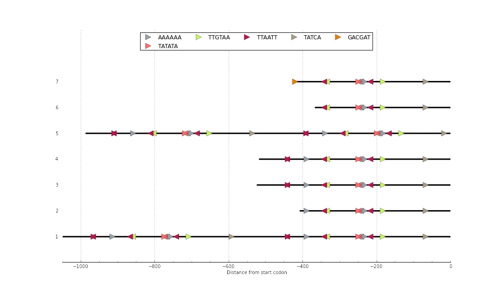

# motif drawer

Draw a chart representing motifs positions in a sequence.

Example chart showing positions of 6 different motifs in 7 promoters:



# Usage

## Standalone version

To use the command line version of motif drawer type the following command:
```bash
python motif_drawer_cli.py sequence_file.fas motif_list.txt
```

A figure will be created named `sequence_file.png`.

A sequence file must be in FASTA format and the list of motifs has to have one motif per line, using only ACGT in capitals, e.g.:

```
TTAATT
GACGAT
GGTAAT
TATCA
TTGTAA
AAAAAA
TATATA
```

## Server version

To start the motif drawer server for personal use, type `python app.py`. You can now direct your browser to `http://0.0.0.0:5000/` and paste your sequences and motifs in the text boxes.